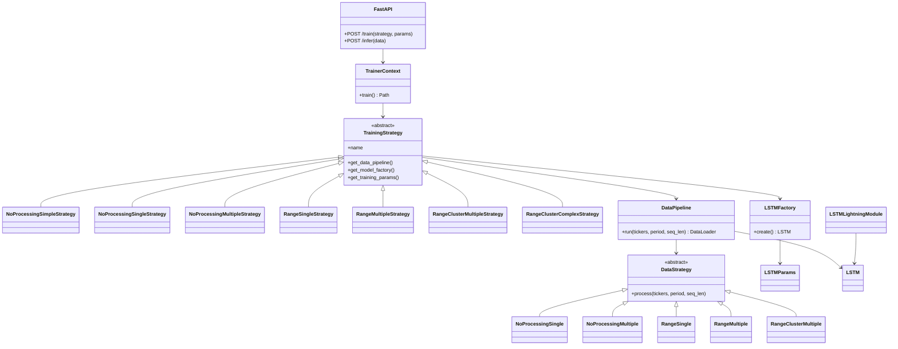
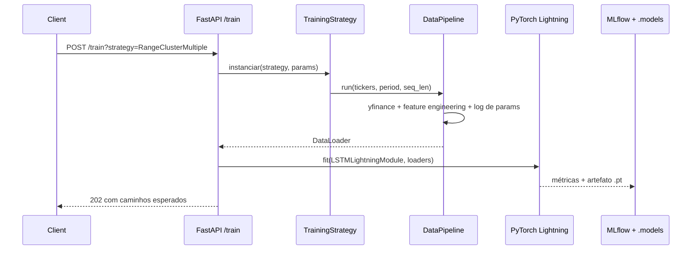
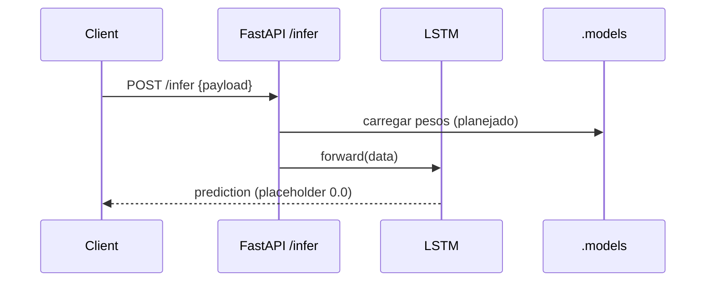

# Machine Learning Engineering 📈
Camada de produtização para expor, treinar e monitorar modelos LSTM de séries temporais (preço de ações) via FastAPI.

## O que há em `productization`
- `src/app/main.py`: ponto de entrada FastAPI com health checks, `/train` (agendamento assíncrono de treino) e `/infer` (placeholder para predições).
- `src/app/model`: LSTM reutilizável (`LSTM`, `LSTMFactory`, `LSTMParams`) e pipeline de dados com múltiplas estratégias (`DataPipeline`, `DataStrategy` e variantes).
- `src/app/train/model.py`: estratégias de treinamento (`TrainingStrategy`) que combinam pipeline, fábrica do modelo, PyTorch Lightning (`LSTMLightningModule`) e MLflow para rastreio/artefatos.
- `src/app/schemas`: contratos de resposta (`SuccessMessage`, `ErrorMessage`, `RESPONSES`).
- `src/infra/terraform`: infra-as-code para empacotar/deploy (ajuste conforme ambiente).

### Estratégias disponíveis
- Sem feature engineering: `NoProcessingSingleStrategy`, `NoProcessingMultipleStrategy`.
- Faixa diária (High-Low): `RangeSingleStrategy`, `RangeMultipleStrategy`.
- Faixa diária + clustering DBSCAN: `RangeClusterMultipleStrategy`.
- Variante mais profunda: `RangeClusterComplexStrategy`.

### Diagrama de classes (núcleo de treino e dados)

### Fluxos reconhecidos

### Como usar
1. Defina `TrainingParams` no corpo do POST e escolha a estratégia via query string (`/train?strategy=RangeMultipleStrategy`).
2. Consulte o diretório `src/app/train/mlruns` para métricas e `src/app/train/.models` para pesos salvos após o término.
3. O endpoint `/infer` ainda é um stub — conecte a carga de pesos e pré-processamento para servir previsões reais.
