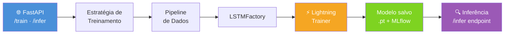
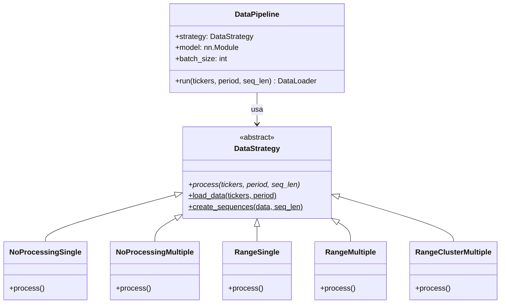
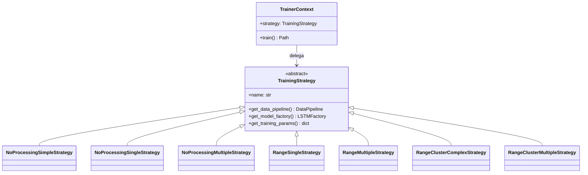
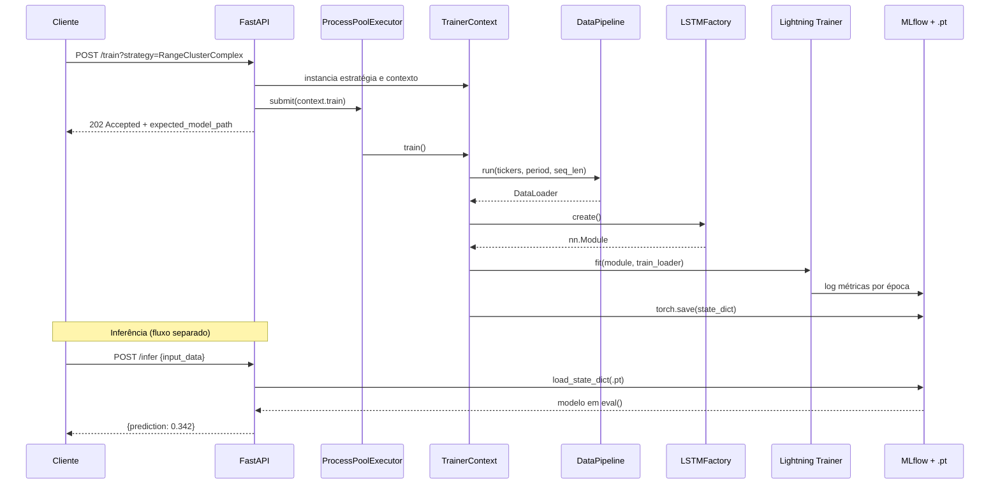

# Machine Learning Engineering — Produtização de Redes Neurais 📈

Esse repositório demonstra, de ponta a ponta, como produtizar uma rede neural LSTM para previsão de preços de ações, expondo-a como um serviço HTTP com treinamento assíncrono, inferência, monitoramento e containerização.

---

## Sumário

1. [Visão Geral da Arquitetura](#1-visão-geral-da-arquitetura)
2. [Pré-requisitos](#2-pré-requisitos)
3. [Instalação](#3-instalação)
4. [Passo a Passo: Produtizando a Rede Neural](#4-passo-a-passo-produtizando-a-rede-neural)
   - 4.1 [Defina os Hiperparâmetros com Pydantic](#41-defina-os-hiperparâmetros-com-pydantic)
   - 4.2 [Construa o Modelo com o Padrão Factory](#42-construa-o-modelo-com-o-padrão-factory)
   - 4.3 [Abstraia a Ingestão de Dados com o Padrão Strategy](#43-abstraia-a-ingestão-de-dados-com-o-padrão-strategy)
   - 4.4 [Abstraia o Treinamento com Estratégias e Contexto](#44-abstraia-o-treinamento-com-estratégias-e-contexto)
   - 4.5 [Padronize e Acelere o Treinamento com PyTorch Lightning e MLflow](#45-padronize-e-acelere-o-treinamento-com-pytorch-lightning-e-mlflow)
   - 4.6 [Carregue e Produtize o Modelo Treinado (Inferência)](#46-carregue-e-produtize-o-modelo-treinado-inferência)
   - 4.7 [Exponha Tudo via API com FastAPI](#47-exponha-tudo-via-api-com-fastapi)
   - 4.8 [Monitore o Serviço](#48-monitore-o-serviço)
   - 4.9 [Containerize com Docker](#49-containerize-com-docker)
   - 4.10 [Teste a Solução](#410-teste-a-solução)
5. [Por Que Cada Camada Importa](#5-por-que-cada-camada-importa)
6. [Executando o Serviço](#6-executando-o-serviço)

---

## 1. Visão Geral da Arquitetura

```
productization/
├── Dockerfile                    # Imagem GPU-ready (CUDA + Python 3.13)
└── src/
    ├── pyproject.toml            # Dependências e metadados do projeto
    └── app/
        ├── __init__.py           # Configuração de logging e variáveis de ambiente
        ├── main.py               # Ponto de entrada FastAPI (rotas, middleware, handlers)
        ├── schemas/
        │   ├── endpoints.py      # Modelos Pydantic de entrada/saída dos endpoints
        │   └── responses.py     # Contratos de resposta HTTP padronizados
        ├── model/
        │   ├── lstm_params.py    # Hiperparâmetros validados via Pydantic
        │   ├── lstm.py           # LSTMFactory (Padrão Factory) + módulo nn.Module
        │   └── data.py           # DataPipeline + DataStrategy (Padrão Strategy)
        ├── train/
        │   ├── __init__.py       # Exporta estratégias e TrainerContext
        │   └── model.py          # TrainingStrategy (ABC) + TrainerContext + Lightning
        └── inference/
            └── __init__.py       # Módulo de carregamento e execução do modelo salvo
```

O fluxo segue três fases desacopladas:



---

## 2. Pré-requisitos

| Requisito | Versão mínima |
|-----------|--------------|
| Python | 3.13 |
| NVIDIA GPU + CUDA | 12.4 (opcional, necessário para a imagem Docker) |
| Docker | 24+ |

---

## 3. Instalação

```bash
# Crie e ative um ambiente virtual
python3.13 -m venv .venv
source .venv/bin/activate        # Linux/macOS
.venv\Scripts\Activate.ps1       # Windows PowerShell

# Instale as dependências do projeto (modo desenvolvimento inclui testes e lint)
pip install -e ".[dev,test,lint,mlflow]"
```

---

## 4. Passo a Passo: Produtizando a Rede Neural

### 4.1 Defina os Hiperparâmetros com Pydantic

O primeiro passo é garantir que os hiperparâmetros do modelo sejam **validados em tempo de execução**, evitando configurações inválidas antes mesmo de iniciar o treinamento. Isso é feito via `LSTMParams` em `app/model/lstm_params.py`:

```python
from app.model.lstm_params import LSTMParams

params = LSTMParams(
    input_size=4,       # número de features (ex: High, Low, Close, Volume)
    hidden_size=64,
    num_layers=2,
    output_size=1,      # prever o preço de fechamento (regressão)
    batch_first=True
)
```

`LSTMParams` herda de `pydantic.BaseModel`, o que garante:
- Validação de tipos automaticamente ao instanciar.
- Mensagens de erro claras quando um campo obrigatório está faltando.
- Integração direta com os schemas do FastAPI para validação das requisições HTTP.

---

### 4.2 Construa o Modelo com o Padrão Factory

Em vez de instanciar a rede manualmente, use a `LSTMFactory` (em `app/model/lstm.py`) para criar arquiteturas de forma declarativa. Isso permite alterar a topologia da rede sem modificar o código de treinamento ou inferência:

```python
from app.model.lstm import LSTMFactory
from app.model.lstm_params import LSTMParams

params = LSTMParams(input_size=4, hidden_size=64, num_layers=2, output_size=1)

# Descreva a arquitetura como um dicionário de camadas
layer_config = {
    "lstm1": "LSTM",
    "linear1": "Linear"
}

factory = LSTMFactory(layer_config=layer_config, params=params)
model = factory.create()  # retorna um nn.Module pronto para treinamento
```

A `LSTMFactory` suporta as seguintes camadas: `LSTM`, `Linear`, `Sigmoid`, `Softmax`. Para adicionar novos tipos de camadas, basta estender o método `get_layer` — o restante da aplicação permanece inalterado.

---

### 4.3 Abstraia a Ingestão de Dados com o Padrão Strategy

A ingestão e o pré-processamento de dados são abstraídos pelo par `DataStrategy` + `DataPipeline` em `app/model/data.py`. Cada estratégia encapsula uma forma diferente de preparar os dados de séries temporais:

| Estratégia | Descrição |
|---|---|
| `NoProcessingSingle` | Dados brutos, um único ticker |
| `NoProcessingMultiple` | Dados brutos, múltiplos tickers |
| `RangeSingle` | Adiciona feature de amplitude diária (High-Low), um ticker |
| `RangeMultiple` | Amplitude diária, múltiplos tickers |
| `RangeClusterMultiple` | Amplitude + clustering DBSCAN para detecção de regime de mercado |

```python
from app.model.data import DataPipeline, RangeClusterMultiple

pipeline = DataPipeline(
    strategy=RangeClusterMultiple(),
    model=model,
    batch_size=32
)

# Retorna um DataLoader PyTorch pronto para o treinador
train_loader = pipeline.run(tickers=["AAPL", "MSFT"], period="2y", seq_len=30)
```

Para adicionar uma nova fonte de dados (ex: dados de opções, sentimento de notícias), basta criar uma classe que herda de `DataStrategy` e implementar o método `process`. Nenhuma mudança é necessária no pipeline ou na API.



---

### 4.4 Abstraia o Treinamento com Estratégias e Contexto

O módulo `app/train/model.py` combina os padrões **Strategy** e **Context** para isolar completamente a lógica específica de cada experimento:

```python
from app.train import TrainerContext, TrainingParams, RangeClusterComplexStrategy

params = TrainingParams(
    tickers=["AAPL", "MSFT"],
    period="2y",
    seq_len=30,
    num_epochs=20,
    learning_rate=1e-3,
    batch_size=32,
    layer_config={"lstm1": "LSTM", "linear1": "Linear"},
    lstm_params=LSTMParams(input_size=5, hidden_size=128, num_layers=2, output_size=1)
)

strategy = RangeClusterComplexStrategy(params)
context = TrainerContext(strategy)
model_path = context.train()  # salva o modelo em train/.models/<strategy_name>.pt
```

O `TrainerContext.train()` orquestra automaticamente:
1. Execução do pipeline de dados.
2. Construção do modelo via factory.
3. Treinamento com PyTorch Lightning.
4. Registro de métricas no MLflow.
5. Salvamento do estado do modelo em disco (`torch.save`).

Estratégias disponíveis (todas expostas via `POST /train`):



---

### 4.5 Padronize e Acelere o Treinamento com PyTorch Lightning e MLflow

O `LSTMLightningModule` em `app/train/model.py` encapsula o ciclo de treinamento completo usando **PyTorch Lightning**, eliminando código boilerplate e garantindo reprodutibilidade:

```python
# O módulo Lightning gerencia automaticamente:
# - training_step / validation_step
# - logging de métricas (train_loss, val_loss)
# - Adam optimizer configurável por lr
# - Checkpointing e Gradient Clipping via pl.Trainer
```

O experimento é rastreado via **MLflow** com `MLFlowLogger`:

```python
mlf_logger = MLFlowLogger(
    experiment_name=strategy.name,
    run_name=strategy.name
)
trainer = pl.Trainer(max_epochs=num_epochs, logger=mlf_logger)
```

Os artefatos ficam em `app/train/mlruns/` e podem ser visualizados com:

```bash
mlflow ui --backend-store-uri ./app/train/mlruns
```

Acesse `http://localhost:5000` para comparar experimentos, métricas e parâmetros entre diferentes estratégias de treinamento.

---

### 4.6 Carregue e Produtize o Modelo Treinado (Inferência)

Após o treinamento, o estado do modelo é salvo como `train/.models/<strategy_name>.pt`. O módulo `app/inference/` é o local correto para implementar o carregamento e a execução do modelo em produção.

O padrão recomendado para carregar o modelo de forma **agnóstica à estratégia** é:

```python
import torch
from app.model.lstm import LSTMFactory
from app.model.lstm_params import LSTMParams
from pathlib import Path

def load_model(strategy_name: str, layer_config: dict, lstm_params: LSTMParams):
    """
    Carrega o estado salvo do modelo de forma abstrata,
    recriando a arquitetura via LSTMFactory.
    """
    factory = LSTMFactory(layer_config=layer_config, params=lstm_params)
    model = factory.create()

    model_path = Path(__file__).parent.parent / "train" / ".models" / f"{strategy_name}.pt"
    model.load_state_dict(torch.load(model_path, map_location="cpu"))
    model.eval()  # desativa dropout e batch norm para inferência
    return model

def predict(model, input_tensor: torch.Tensor) -> float:
    """
    Executa inferência sobre uma sequência de entrada.
    input_tensor: shape (1, seq_len, num_features)
    """
    with torch.no_grad():
        output = model(input_tensor)
    return output.item()
```

**Pontos-chave da abstração de inferência:**

- `model.eval()` é obrigatório para desativar camadas de regularização (Dropout, BatchNorm) em produção.
- `torch.no_grad()` elimina o grafo computacional e reduz o uso de memória durante a predição.
- A arquitetura do modelo é reconstruída identicamente via `LSTMFactory`, garantindo que `load_state_dict` funcione corretamente.
- O endereço `map_location="cpu"` permite que o modelo seja carregado em servidores sem GPU, separando o ambiente de treinamento (GPU) do ambiente de inferência (CPU).
- O endpoint `POST /infer` em `main.py` é o ponto de integração: recebe os dados, pré-processa, chama `predict()` e retorna a predição.

---

### 4.7 Exponha Tudo via API com FastAPI

O `app/main.py` é o ponto de entrada do serviço. A API é organizada em grupos de endpoints por responsabilidade:

| Tag | Endpoint | Descrição |
|-----|----------|-----------|
| Configuração | `GET /` | Health check |
| Configuração | `GET /ready` | Readiness check |
| Configuração | `GET /startup` | Startup check |
| Treinamento | `POST /train?strategy=<nome>` | Dispara treinamento assíncrono |
| Inferência | `POST /infer` | Realiza predição com o modelo salvo |

O treinamento é executado de forma **assíncrona** via `ProcessPoolExecutor`, evitando que uma chamada de treinamento bloqueie outras requisições:

```python
future = TRAINING_EXECUTOR.submit(context.train)
_ACTIVE_TRAINING_JOBS.add(future)
future.add_done_callback(_cleanup_future)
```

A documentação interativa da API está disponível via Swagger/OpenAPI em `/api/v1/openapi.json` após iniciar o serviço.



---

### 4.8 Monitore o Serviço

A produtização não termina no deploy. O serviço inclui múltiplas camadas de observabilidade:

**Logging estruturado** (`app/__init__.py`):
- Handler de console com nível `INFO`.
- Handler de arquivo rotativo (`app.log`, 10 MB por arquivo, 5 backups).
- Todos os erros de validação e resposta são capturados com contexto da requisição (método, URL, headers, body).

```python
# Exemplo de log gerado automaticamente em caso de erro
logger.error(
    f"Validation error: {exc.errors()}",
    extra={"request": {"method": ..., "url": ..., "body": ...}}
)
```

**Rastreamento de experimentos com MLflow**:
- Métricas de treinamento (`train_loss`) e validação (`val_loss`) por época.
- Hiperparâmetros, duração e artefatos por experimento.
- Interface web local via `mlflow ui`.

**Health/Readiness/Startup probes** (`GET /`, `GET /ready`, `GET /startup`):
- Compatíveis com Kubernetes Liveness, Readiness e Startup Probes.
- Permitem que orquestradores de contêineres detectem falhas e reiniciem instâncias automaticamente.

**GPU Health Check no Docker**:
```dockerfile
HEALTHCHECK --interval=1m --timeout=10s --retries=3 CMD nvidia-smi || exit 1
```
O container falha imediatamente se a GPU não estiver disponível, evitando execuções silenciosas em CPU quando o treinamento requer aceleração.

---

### 4.9 Containerize com Docker

O `Dockerfile` usa como base `nvidia/cuda:12.4.1-cudnn-runtime-ubuntu22.04`, garantindo suporte a GPU para treinamento acelerado:

```bash
# Build da imagem
docker build -t lstm-service:latest .

# Execução com GPU
docker run --gpus all -p 8000:8000 lstm-service:latest

# Execução sem GPU (apenas CPU)
docker run -p 8000:8000 lstm-service:latest
```

Boas práticas implementadas no Dockerfile:
- **Multi-stage caching**: dependências copiadas antes do código-fonte para aproveitar o cache de camadas.
- **Usuário não-root** (`appuser`): o processo da aplicação não roda como `root`, seguindo o princípio do menor privilégio.
- **Variáveis de ambiente**: `PYTHONUNBUFFERED=1` garante que os logs apareçam imediatamente no stdout do container.
- **Porta exposta**: `8000`, servida por `uvicorn` com suporte a múltiplos workers.

---

### 4.10 Teste a Solução

Os testes em `tests/` cobrem as três camadas críticas da aplicação:

```bash
# Execute todos os testes com relatório de cobertura
pytest tests/ --cov=app --cov-report=term-missing
```

| Arquivo de Teste | O que valida |
|---|---|
| `test_lstm_factory.py` | Criação correta de modelos via `LSTMFactory` para diferentes configurações |
| `test_lstm_data.py` | Pipeline de dados: formato dos tensores, tamanho do DataLoader |
| `test_training_strategies.py` | Que cada estratégia retorna o nome correto, o `DataPipeline` e a `LSTMFactory` esperados |

---

## 5. Por Que Cada Camada Importa

### A Importância da API

A camada de API (FastAPI) é o **contrato público** entre o modelo de ML e o mundo externo. Sem ela, o modelo só pode ser usado por quem tem acesso direto ao código Python. Com a API:

- Times de produto podem disparar treinamentos e obter predições sem conhecer PyTorch.
- Diferentes estratégias de treinamento são selecionáveis em tempo de execução via parâmetro `?strategy=`.
- Validação automática de entrada/saída via Pydantic garante que dados malformados nunca cheguem ao modelo.
- CORS configurado para `["*"]` permite integração imediata com frontends e outras APIs.

### A Importância da Abstração de Treinamento e Ingestão

Os padrões **Strategy** e **Factory** desacoplam *o quê* é feito de *como* é feito:

- **Trocar a fonte de dados** (ex: de `yfinance` para uma API interna) requer apenas uma nova classe `DataStrategy` — o pipeline, o treinador e a API permanecem iguais.
- **Trocar a arquitetura** (ex: de LSTM para Transformer) requer apenas configurar um novo `layer_config` — não há necessidade de alterar o código de treinamento.
- **Adicionar um novo experimento** significa criar uma nova `TrainingStrategy` — sem tocar no código existente.

Esse princípio de **Open/Closed** (aberto para extensão, fechado para modificação) é fundamental em projetos de ML onde as hipóteses mudam constantemente.

### A Importância das Bibliotecas de Padronização e Aceleração

- **PyTorch Lightning** elimina ~200 linhas de boilerplate por experimento (loop de treinamento, gradient clipping, checkpointing, logging). Qualquer engenheiro que conhece Lightning entende imediatamente o código, independentemente do domínio do problema.
- **Pydantic** garante que erros de configuração sejam capturados em tempo de parse, não no meio do treinamento de 20 épocas.
- **scikit-learn** (`StandardScaler`, `DBSCAN`) integra o ecossistema clássico de ML ao pipeline de deep learning sem reescritas.
- **yfinance** abstrai a ingestão de dados financeiros, permitindo que o código foque na transformação e modelagem.

### A Importância do Monitoramento

Um modelo em produção sem monitoramento é um modelo que falha silenciosamente. As camadas de observabilidade aqui implementadas garantem:

- **Rastreabilidade**: cada experimento registrado no MLflow pode ser reproduzido com os mesmos hiperparâmetros.
- **Auditoria**: todos os erros de validação são logados com o contexto completo da requisição.
- **Disponibilidade**: os health probes permitem que Kubernetes ou qualquer orquestrador detecte e recupere instâncias com falha automaticamente.
- **Diagnóstico rápido**: logs rotativos em arquivo garantem que informações de debug sejam preservadas mesmo após reinicializações.

---

## 6. Executando o Serviço

```bash
# Desenvolvimento local
cd productization/src
uvicorn app.main:app --reload --host 0.0.0.0 --port 8000

# Disparar um treinamento (exemplo com curl)
curl -X POST "http://localhost:8000/train?strategy=RangeClusterComplexStrategy" \
  -H "Content-Type: application/json" \
  -d '{
    "tickers": ["AAPL", "MSFT"],
    "period": "2y",
    "seq_len": 30,
    "num_epochs": 10,
    "learning_rate": 0.001,
    "batch_size": 32,
    "layer_config": {"lstm1": "LSTM", "linear1": "Linear"},
    "lstm_params": {
      "input_size": 5,
      "hidden_size": 128,
      "num_layers": 2,
      "output_size": 1,
      "batch_first": true
    }
  }'

# Visualizar experimentos MLflow
mlflow ui --backend-store-uri ./app/train/mlruns
```

A documentação completa da API estará disponível em `http://localhost:8000/api/v1/openapi.json` após a inicialização do serviço.

